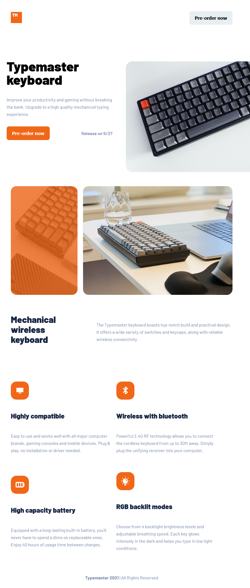

# Frontend Mentor - Typemaster pre-launch landing page solution

This is my solution to the [Typemaster pre-launch landing page challenge on Frontend Mentor](). Frontend Mentor challenges help you improve your coding skills by building realistic projects.

## Table of contents

- [Frontend Mentor - Typemaster pre-launch landing page solution](#frontend-mentor---typemaster-pre-launch-landing-page-solution)
  - [Table of contents](#table-of-contents)
  - [Overview](#overview)
    - [The challenge](#the-challenge)
    - [Screenshot](#screenshot)
    - [Links](#links)
  - [My process](#my-process)
    - [Built with](#built-with)
    - [What I learned](#what-i-learned)
    - [Continued development](#continued-development)
    - [Useful resources](#useful-resources)
  - [Author](#author)
  - [Acknowledgments](#acknowledgments)


## Overview

### The challenge

Users should be able to:
- view the site on almost every device. From mobile, tablet , desktop and even
large tv screens 
- the site must be accessible to all users including keyboard users

### Screenshot



Screenshot for tablet design , taken at 768px screen width

### Links

- Solution URL: [Link to solution](https://github.com/ChamuMutezva/typemaster-pre-launch-landing-page)
- Live Site URL: [Link to live site](https://chamumutezva.github.io/typemaster-pre-launch-landing-page/)

## My process

### Built with

- Semantic HTML5 markup
- sass scss
- CSS custom properties
- Flexbox
- CSS Grid
- Mobile-first workflow
- [Parcel](https://parceljs.org/) - Sass compiler and application bundler

### What I learned

Tried to use the new dart sass which is now using modules. I wanted to practice using 
`@use` and `@forward`. Could not get it working with vs code live sass compiler as it 
is still using the old ruby sass.

My option was to use **Parcel bundler**  The setup is as follows: 
- install the package using npm (it can also be installed using yarn) with
   `npm install -g parcel-bundler`
- create a **package.json** file in your app folder with `npm init -y`
- adjust the **package.json** file scripts section to the following: 
``` "scripts": {
    "dev": "parcel index.html",
    "build": "npm run parcel && npm run sass",
    "sass": "sass styles/style.scss:styles/style.css",
    "parcel": "parcel build index.html"    
  },
  ```
Of particular interest is the sass part `sass styles/style.scss:styles/style.css`
- Part one **sass** - i think it identifies that convert the following **Part two** 
- Part two `styles/style.scss:styles/style.css` convert the part before the semi-colon
`styles/style.scss` which is sass into a css file `scss:styles/style.css`. In this particular example
take note that **styles** is a folder and `style.scss` and `style.css` are the files. So replace that part 
according to the structure of your files.

- link your file correctly in your html. `<link rel="stylesheet" href="./styles/style.css" />`
The tutorial had indicated to use `<link rel="stylesheet" href="./styles/style.scss" />` in the 
html which worked during production but that did not work during build and deploying to github

*** Run the site ***
    `npm run dev`

*** Build the site ***
    `npm run build`


### Continued development
My sass skills are still in the early stages, I will be working on improving 
how to use the new sass features that are being recommended for example `@use` and `@forward`
and gradually removing `@import` from my workflow.

### Useful resources

- [Parcel](https://parceljs.org/)- This helped me to set up a compiler for sass to css.
see outline above.

## Author

- Website - [Chamu Mutezva](https://github.com/ChamuMutezva)
- Frontend Mentor - [@ChamuMutezva](https://www.frontendmentor.io/profile/ChamuMutezva)
- Twitter - [@ChamuMutezva](https://twitter.com/ChamuMutezva)


